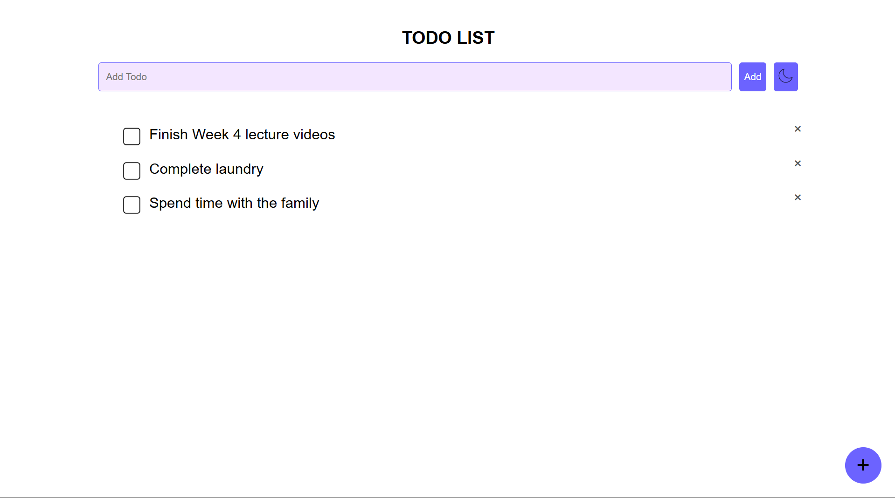

# 📝 Simple To-Do List Website

A minimal and responsive To-Do List web app built using **HTML**, **CSS**, and **JavaScript**. This project helps users manage daily tasks with ease—add, delete, and mark tasks as complete.

## 🚀 Features

- ✅ Add new tasks
- 🗑️ Delete tasks
- ✏️ Mark tasks as completed
- 💾 Local storage support

## 📸 Preview

## 🛠️ Tech Stack

- **HTML5** – Structure of the app
- **CSS3** – Styling and layout
- **JavaScript** – Dynamic task handling and interactivity

## 🛠️ Live website

Check the live website[here](https://yashwanthdevelops.github.io/To-Do-list/)
